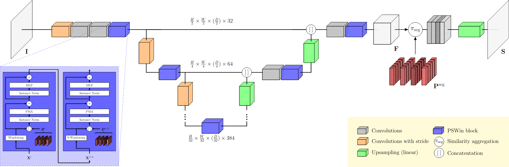
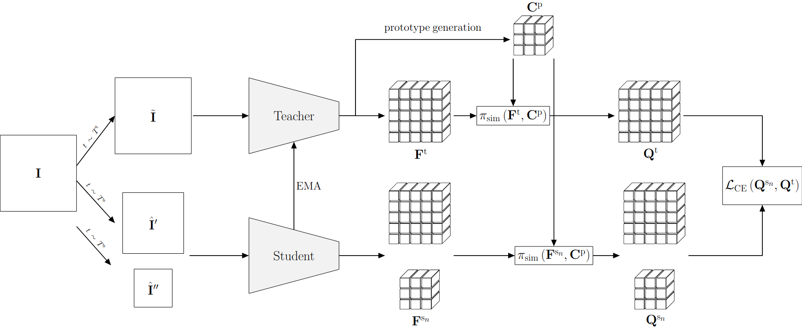
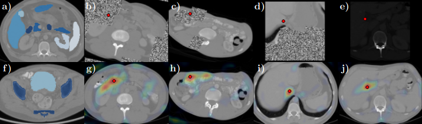
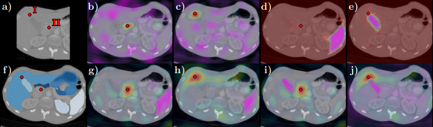

# Prompt-able UNet (PUNet) for Medical Image Segmentation

## Code

Accompanying code for the approach presented in [**Prompt Tuning for Parameter-efficient Medical Image Segmentation**](https://arxiv.org/abs/2211.09233).    

Based on this code, we

* introduce a deeply prompt-able encoder-decoder architecture (prompt-able UNet, PUNet) that can incorporate additional class-dependent prompt tokens to achieve dense binary and multi-class segmentation
* contribute architectural components comprising prompt-able shifted window (PSWin) blocks, a heterogeneous bias score generation within the attention scheme, and a weighted similarity aggregation to enable token-dependent
class predictions
* propose a contrastive pre-training scheme specifically designed for dense self-supervision by soft assignments to
online generated prototypes to establish anatomical representations while circumventing a hard separation of the
contrastive attraction and repulsion
* show that ”prompting” of the pre-trained and frozen architecture by non-frozen (learned) prompt tokens is sufficient
for adaptation to a segmentation downstream task on medical imaging data,
* leverage our assignement-based self-supervision scheme to enable the concurrent application of a prompt-dependent segmentation supervision in the pre-training
phase, further reducing the performance gap between fully fine-tuned and efficiently adapted variants

   

The published code contains
* the prompt-able UNet (PUNet) architecture and underlying PSWin blocks (see Figure 1)
* the proposed dense self-supervision scheme based on contrastive prototype assignments (see Figure 2)
* the training routines, including using various prompt-dependent predictions in a single batch
* the ability to process 2D as well as 3D imaging data (tested FOVs are included in the [config file](./shell/cfgs.sh))

*This code is provided as is. It builds upon the PyTorch Lightning framework. Where possible MONAI functionality has been used.*

___
## Exemplary usage

See the data [pre-processing](.src/data/datasets/prepare_tcia.py) and [data gathering](.src/data/datasets/gather_tcia_btcv.py) on how to prepare data for e.g. TCIA .

### Phase 1 - Training by self-supervision / known classes

> python3 ./src/main.py --gpus 1 --batch_size 8 --architecture wip --dataset tcia_btcv --dir_images /path/to/my/data --dir_masks /path/to/my/labels

Valid configuration variants are included in the [config file](./shell/cfgs.sh) which is used for the [phase 1 shell script](./shell/train_p1.sh).  
For the loss configuration use 
* *self* for self-supervision,
* *meta* for segmentation (semi-)supervision,
* *meta_self* for joint supervision,
* and *_noninstructed* for non-prompt-based architecture variants.

Have a look at the flags of the [main module](./src/modules/instruction_model.py) for more details.

### Phase 2 - Downstream adaptation to *new* classes on frozen model

> python3 ./src/main.py --gpus 1 --batch_size 8 --architecture wip --dataset tcia_btcv --dir_images /path/to/my/data --dir_masks /path/to/my/labels --ckpt /path/to/my/ckpt --no_overwrite --cold_start --downstream --adaptation_variant prompting --selective_freezing --label_indices_base 1 --label_indices_downstream_active 2 --max_epochs 100

Valid configuration variants are included in the [config file](./shell/cfgs.sh) which is used for the [phase 2 shell script](./shell/train_p2.sh).  
New classes can be provided via class index, e.g. --label_indices_downstream_active 2  
Have a look at the flags of the [main module](./src/modules/instruction_model.py) for more details.

### Testing

> python3 ./src/main.py --gpus 1 --mode test --architecture wip --dataset tcia_btcv --dir_images /path/to/my/data --dir_masks /path/to/my/labels --ckpt /path/to/my/ckpt --no_overwrite --cold_start

___
## Illustrations
    
Figure 1: Schematic illustration of the proposed prompt-able UNet (PUNet). The network consists of an encoder with down-convolutions and a decoder with linear upsampling layers. A depth of 5 levels is chosen with 32, 64, 128, 256, 384 hidden channels $C$ for each respective level. Throughout the network prompt-able shifted window (PSWin) blocks are placed. These blocks incorporate prompt-able multi-head attention (PMA) layers. This enable the injection of prompt tokens $\mathbf{P}$ that can be learned in a downstream adaptation task. The decoder embedding $\mathbf{F}$ is further processed by a similarity aggregation $\pi_{\mathrm{seg}}$ together with prompt tokens $\mathbf{P}^{\mathrm{seg}}$ for the prediction of class probabilities in the segmentation map $\mathbf{S}$.

   
Figure 2: Input image slices $\mathbf{I}$ are augmented for a student teacher combination. Differently sized views $\hat{\mathbf{I}}'$, $\hat{\mathbf{I}}''$, with varying augmentations including partial masking, are passed to a student as well as a less augmented variant $\tilde{\mathbf{I}}$ to a teacher. The teacher network weights are kept up to date by an exponential moving average (EMA). Teacher output embeddings $\mathbf{F}^{\mathrm{t}}$ are further processed by an iterative clustering with spatially weighted assignments, which results in online generated prototypes $\mathbf{C}^{\mathrm{p}}$. Similarity assignments are calculated by means of a softmaxed cosine similarity $\pi_{\mathrm{sim}}$ with respect to predicted embeddings $\mathbf{F}^{\mathrm{t}}$ and $\mathbf{F}^{\mathrm{s}_n}$ for the $n$ th student, as well as the prototype codes $\mathbf{C}^{\mathrm{p}}$. Derived assignments $\mathbf{Q}^{\mathrm{t}}$ and $\mathbf{Q}^{\mathrm{s}_n}$ are enforced to have similar contrastive prototype assignments (CPA) by a cross-entropy (CE) loss.

   
Figure 3: a/f) Exemplary slices of the TCIA/BTCV and CT-ORG dataset, with annotated masks shown in shades of blue, b-e) augmented student views with masked regions or strong contrast adjustments, g-j) respective teacher views with overlays of the cosine similarity of the predicted teacher embedding $\mathbf{F}^{\mathrm{t}}$ and the student embedding $\mathbf{F}^{\mathrm{s}}_{i,j}$ at an arbitrary selected point of interest (indicated by a red dot) with indices $i,j$ in the corresponding student view. Highly similar regions appear red in the teacher view. The approach learns a robust embedding that enforces context learning, and is thus able to generate proper similarities, despite the origin region being severely affected. Note, that teacher augmentations have been disabled for better visual clarity in this illustration.

   
Figure 4: Visualization of cosine similarities between predicted teacher embeddings $\mathbf{F}^{\mathrm{t}}$ and a student embedding $\mathbf{F}^{\mathrm{s}}_{i,j}$ at arbitrary selected points of interest (red dots with labels I and II) with respective indices $i,j$ for the student view shown in (a). f) The respective teacher slice with points of interest located closely above the gall bladder (I) and below the pancreas (II). b-c) Teacher views with cosine similarities for the self-supervised pre-trained model for respective points of interest. The similarity is densely concentrated around the queried point. d-e) Cosine similarities of the segmentation supervised pre-trained model with prompt tokens active for the spleen (d) and the gallbladder (e). Pink regions indicate highly dissimilar regions (inverse of the similarity map) and serve as indication of the generated segmentation masks. There is no difference with respect to location outside of the active target region. g-j) Similarity maps for the combined self- and segmentation supervised pre-trained model. Densely concentrated similarities are visible alongside highly dissimilar active target regions. In (j) it can be seen, that the prompt tokens can successfully alter regions that showed high similarity in (h) but belong now to the active target region (by the change from red (in h) to pink (in j) in the periphery of the point of interest.
